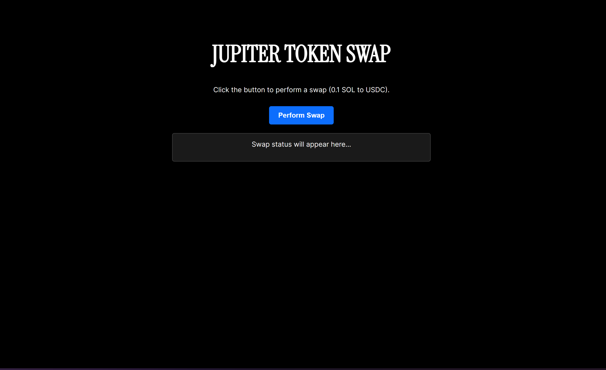

# Simple Jupiter Swap Web App

This is a basic Node.js web application built with Express that provides a simple interface to perform a token swap on the Solana blockchain using the Jupiter Aggregator API.



## Functionality

-   Serves a simple HTML frontend.
-   Provides an API endpoint (`/api/swap`) that:
    -   Fetches a quote from Jupiter for a fixed swap (0.1 SOL to USDC).
    -   Constructs, signs, and sends the swap transaction using a backend wallet (configured via `.env`).
    -   Returns the transaction ID upon success or an error message.

## Setup (Local)

1.  Install dependencies: `pnpm install`
2.  Create a `.env` file in the root directory with your Solana private key:
    ```
    PRIVATE_KEY=YOUR_SECRET_KEY_HERE
    ```
3.  Start the server: `node index.js` or `pnpm start`
4.  Open `http://localhost:3000` in your browser.

## Deployment

This app can be deployed to platforms like Vercel, Render, or Railway. Ensure you set the `PRIVATE_KEY` as an environment variable on the deployment platform. 